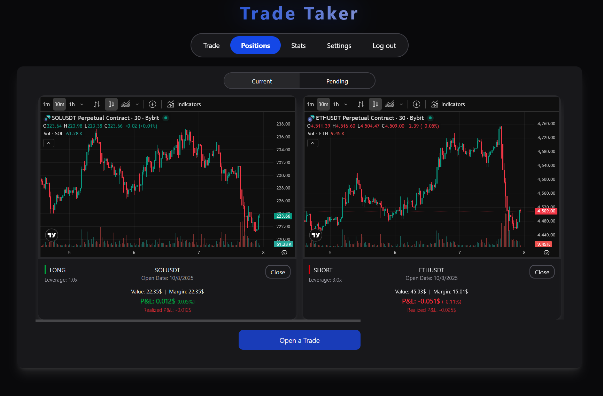
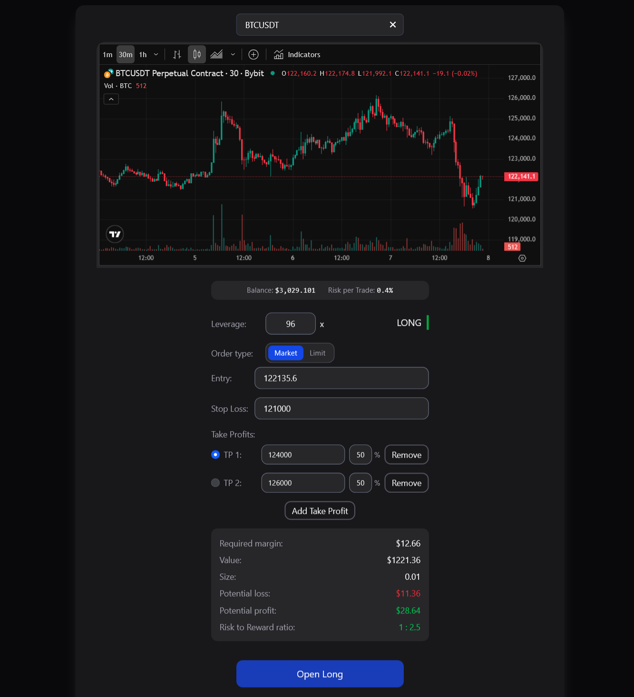
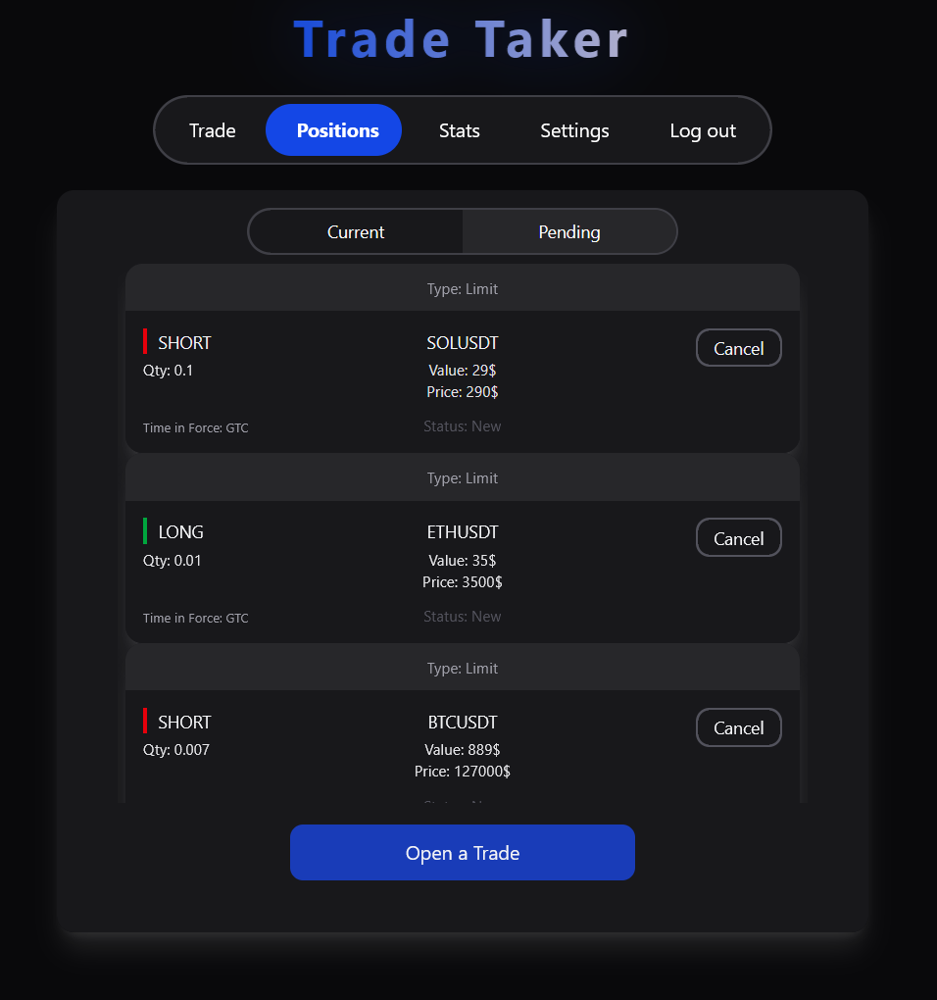
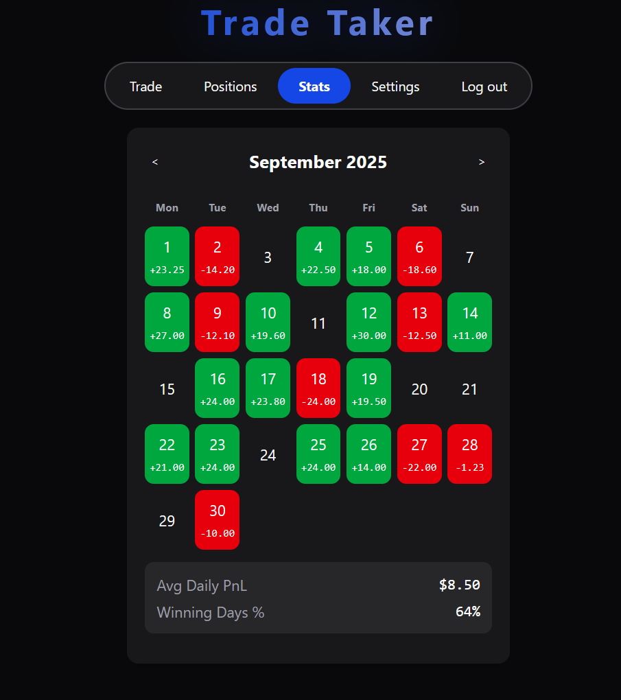
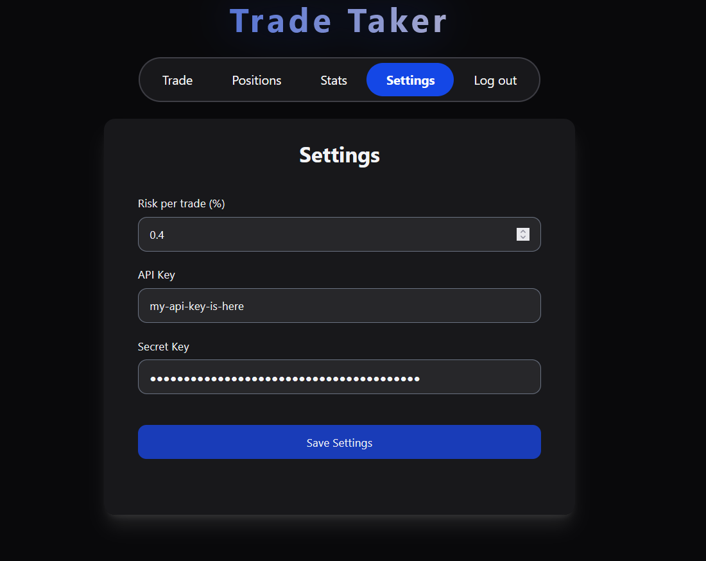
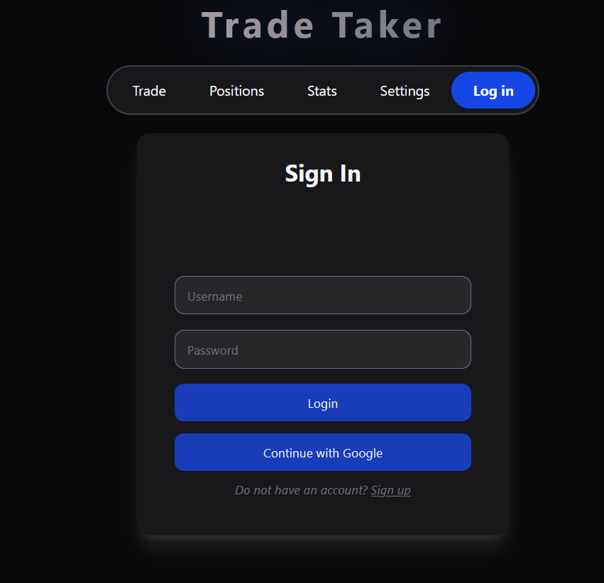
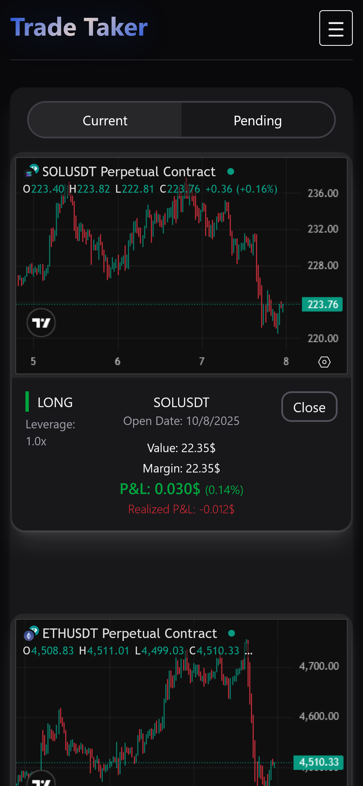

# Trade Taker

**Trade Taker** is a web app that addresses a common challenge for crypto traders: managing risk effectively.
It automates position sizing, calculates risk/reward, and provides performance
analytics  — with a responsive, mobile-friendly UI. Built on a modern Java/Spring backend and a reactive SvelteKit frontend.

**Demo video:** *[Here Video]*

## Key Features

1. **Automated Risk & Trade Management**
    * **Precision Position Sizing:** Calculates the optimal position size based on your account equity and predefined
      risk percentage. No more manual calculations.

    * **Full Trade Lifecycle Preview:** Before execution, see your exact required margin, leverage, potential
      profit/loss, and risk-to-reward ratio.

    * **One-Click Execution:** Place limit or market orders directly to Bybit with attached take-profit
      orders (reduce-only).

    * **Position & Order Management:** View and manage all open positions and pending orders.


2. **Security & Account Integration**
    * **Authentication:** Secure JWT auth with one-click Google OAuth2.
    * **Encrypted API Key Storage:** Bybit secrets encrypted at rest (AES), never stored in plain text.

3. **Performance Analytics**
    * **PnL Calendar:** Visualize daily performance in a calendar view to spot winning/losing streaks.

4. **Responsive UI**
    - Fully responsive layout (phone → desktop), touch-friendly controls, off-canvas navigation.


## Technologies Used

- **Backend:** Java 21, Spring Boot 3, Spring Security (JWT + OAuth2), JPA/Hibernate, Spring Cache
- **Frontend:** SvelteKit, TailwindCSS, svelte-motion
- **Databases:** PostgreSQL, H2 (tests)
- **Tests:** JUnit 5
- **API & SDK:** Bybit Official Java SDK, TradingView Charts

## Screenshots

### Open Positions



### Trade Preview



### Pending Orders



### PnL Calendar



### Settings / Login




### Mobile (Example)




## Installation and Setup

1. **Clone the repository**

   ```bash
   git clone https://github.com/Tomek4861/TradeTaker.git
   cd TradeTaker
   ```

<details>
<summary>2. <b>Backend setup (Spring Boot, <code>application-dev.properties</code>)</b></summary>

Create <code>backend/src/main/resources/application-dev.properties</code> with your local dev config.

```properties
# --- Database ---
spring.datasource.url=jdbc:postgresql://localhost:5432/your_database_name_goes_here
spring.datasource.username=postgres
spring.datasource.password=your_password
# --- JWT ---
# 32-byte key in hex or Base64 your own
security.jwt.secret-key=<your-dev-jwt-secret>
security.jwt.expiration-time=7200000
# --- Logging (Feel free to disable this logging) ---
logging.level.root=INFO
logging.level.org.springframework=DEBUG
logging.level.org.springframework.security=TRACE
logging.level.org.hibernate.SQL=DEBUG
logging.level.org.hibernate.type.descriptor.sql=TRACE
# --- Google OAuth2 (dev) ---
spring.security.oauth2.client.registration.google.client-id=<your-google-client-id>
spring.security.oauth2.client.registration.google.client-secret=<your-google-client-secret>
spring.security.oauth2.client.registration.google.scope=openid,email,profile
# --- AES key for encrypting Bybit secret keys in DB ---
app.encryption.secret-key=<16or24or32-byte-key>
```

Run the backend with the <b>dev</b> profile:

```bash
cd backend
mvn clean spring-boot:run -Dspring-boot.run.profiles=dev
```

The API will be available at <code>http://localhost:8080</code>.

</details>

<details>
<summary>3. <b>Frontend setup (SvelteKit)</b></summary>

Run:

```bash
cd ../frontend
npm install   # or pnpm install
npm run dev
```

Open `http://localhost:5173`

</details>

4. **Login & configure**

    * Register/login.
    * In **Settings**, add your **Bybit API key/secret** and set **risk %**.

## Future Improvements

* Docker Compose + CI/CD pipeline.
* More advanced analytics dashboards.

## License

This project is licensed under the **MIT License**. See the [LICENSE](./LICENSE) file for details.
